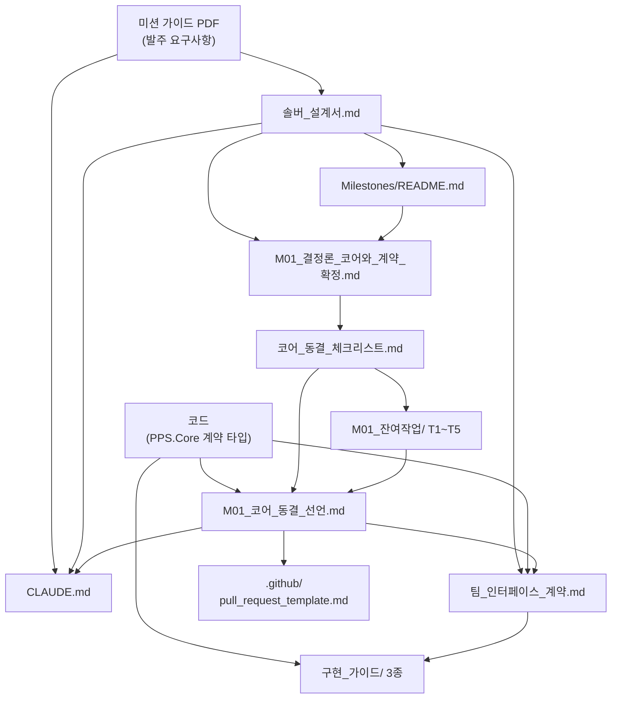

# 문서 지도

**어떤 문서를 고쳤을 때 무엇을 함께 고쳐야 하는가**를 한곳에 모은 것.

각 문서 맨 위에도 같은 정보가 `근거` / `이 문서가 바뀌면` 두 줄로 붙어 있다.
둘이 어긋나면 **이 지도가 아니라 각 문서의 머리말이 정본**이다 — 고치는 사람이 그 문서를 열고 있기 때문이다.

> **문서를 고칠 때는 `docs` 에이전트를 쓴다.** 참조를 **양방향으로** 갱신하는 절차가 거기 박혀 있다
> (`.claude/agents/docs.md`). 한쪽만 고치면 그래프가 썩는데, 그게 손으로 할 때 제일 자주 나는 실수다.

---

## 흐름

---

## 무엇을 고쳤을 때 무엇을 보나

| 고친 것 | 함께 볼 문서 |
|---|---|
| **미션 가이드** (요구사항 원문) | 설계서 · CLAUDE.md — 요구가 바뀌면 설계 전제가 흔들린다 |
| **솔버_설계서.md** | CLAUDE.md · 팀_인터페이스_계약 · Milestones/README · M01 · 체크리스트 |
| **코드 — 계약 타입** (`Contracts/`) | 팀_인터페이스_계약 · 구현_가이드 3종 · 동결 선언문 §1 |
| **코드 — 시뮬 실행부** (`Sim/`, `Devices/`) | 동결 선언문 §1·§4·§5 · 해당 구현 가이드 |
| **코드 — 테스트** | 체크리스트의 `완료 근거` · 동결 선언문 §6 (테스트 수가 바뀌면 판정 수치도 바뀐다) |
| **팀_인터페이스_계약.md** | 구현_가이드 3종 — 계약 목록과 사용법이 갈라지면 팀원이 헤맨다 |
| **코어_동결_체크리스트.md** | T1~T5 · 동결 선언문 §6 |
| **M01_코어_동결_선언.md** | PR 템플릿 · CLAUDE.md 작업 방식 · 팀_인터페이스_계약 §3 |
| **Milestones/README.md** | 해당 마일스톤 문서 |

---

## 특히 잘 어긋나는 짝

경험상 갈라지기 쉬운 조합이다. 하나를 고치면 **반드시** 다른 쪽을 확인한다.

| 짝 | 왜 |
|---|---|
| 동결 선언문 §3 ↔ PR 템플릿 | 변경 절차가 두 곳에 적혀 있다. **다르면 둘 다 안 지켜진다** |
| 계약 타입 코드 ↔ 팀_인터페이스_계약 | 문서가 코드보다 늦으면 팀원이 없는 필드를 쓴다 |
| 테스트 개수 ↔ 동결 선언문 §6 | 판정 수치(EditMode 20/20 · PlayMode 55/55)는 실행 시점의 사실이다. 테스트가 늘면 재실행 없이는 판정이 무효다 |
| 체크리스트 항목 ↔ 실제 테스트 이름 | A-1 매트릭스처럼 케이스와 테스트를 1:1로 매핑해 둔 곳은 테스트 이름이 바뀌면 즉시 어긋난다 |

---

## 문서 목록

### 상위 근거

| 문서 | 내용 |
|---|---|
| `미션 가이드_링크즈_물리 퍼즐 솔버.pdf` | 발주 요구사항 원문. **모든 것의 최상류** |
| [솔버_설계서.md](솔버_설계서.md) | 결정론 코어·솔버·프리미티브·리플레이 설계. 코어 코드의 단일 근거 |
| [../CLAUDE.md](../CLAUDE.md) | 작업 규칙 요약. 매 세션 로드된다 |

### 계약과 가이드

| 문서 | 대상 |
|---|---|
| [팀_인터페이스_계약.md](팀_인터페이스_계약.md) | 전원 — **무엇이 있는가** |
| [구현_가이드/맵_에디터.md](구현_가이드/맵_에디터.md) | C — **어떻게 만드는가** |
| [구현_가이드/드로잉_툴.md](구현_가이드/드로잉_툴.md) | B |
| [구현_가이드/장치_추가.md](구현_가이드/장치_추가.md) | B |

### 마일스톤

| 문서 | 내용 |
|---|---|
| [Milestones/README.md](Milestones/README.md) | M01~M06 목록과 상태 |
| [Milestones/M01_결정론_코어와_계약_확정.md](Milestones/M01_결정론_코어와_계약_확정.md) | M01 범위·DoD·회고 |
| [Milestones/코어_동결_체크리스트.md](Milestones/코어_동결_체크리스트.md) | 판정 게이트 + 항목별 완료 근거 |
| [Milestones/M01_코어_동결_선언.md](Milestones/M01_코어_동결_선언.md) | **동결의 실물** |
| [Milestones/M01_잔여작업/](Milestones/M01_잔여작업/README.md) | T1~T5 진행 기록 |
| `Milestones/TestResults/` | 실행 결과 XML — 판정의 근거물 |
